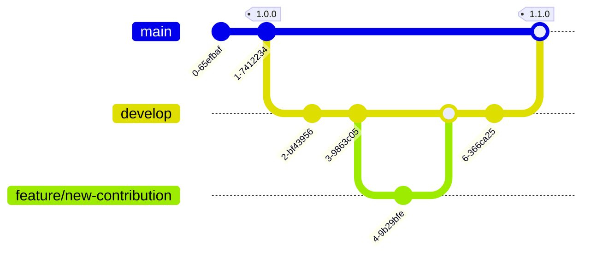

**Thank you for making Rekono greater!**


## Branches

**Create Pull Requests to the `develop` branch of this project**. All the Pull Requests should be reviewed and approved before been merged and after that, your code will be included in the next release.




## Development environment

You can follow the [from source installation](https://github.com/pablosnt/rekono-cli#from-source) installation guide to prepare your development environment.


### Unit Tests

Unit tests can be executed using this command:

```
# pwd: src/
coverage run -m pytest
```

New Rekono contributions should tested using unit tests.


### CI/CD

This project has the following checks in _Continuous Integration_:

1. `Code style`: check the source code style using `mypy` and `flake8`.

2. `SAST`: scan source code using `semgrep` to find vulnerabilities. This is a Static Application Security Testing.

3. `Secrets scanning`: check the source code using `detect-secrets` to find leaked passwords, tokens or other credentials that could be exposed.

4. `Unit testing`: check if the project works executing the unit tests.

5. `Snyk`: check the project dependencies to find libraries with known vulnerabilities. This is a Software Composition Analysis (SCA).

**All CI/CD checks should be passed before merging any Pull Request**, so it's advised to install the pre-commit hooks in your local repositories to check your changes before commit them:

```
# pwd: root directory
python3 -m pip install pre-commit
pre-commit install
```


### Way of Code

There are some guidelines to keep the code clean and ensure the correct working of the application:

- Keep code style
- Comment your code, specially classes and methods.
- Make unit tests for all your code to ensure its correct working.
- Don't include code vulnerabilities or vulnerable libraries.
